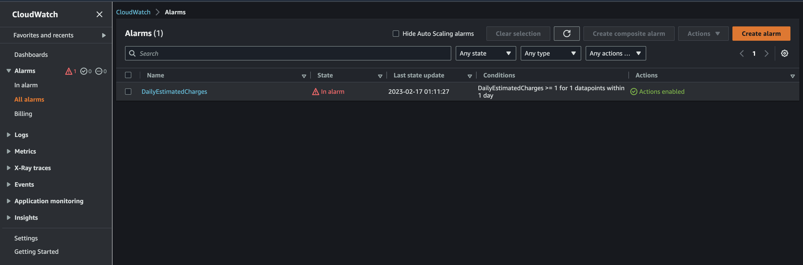
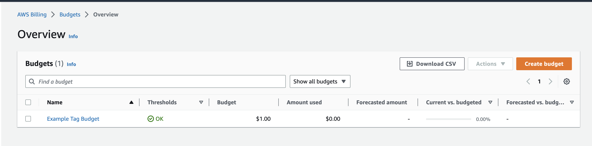

# Week 0 — Billing and Architecture

## Required Homework 

### Use cloudshell
Below is an image showing use of cloudshell
[Image of the Recreated Diagram](assets/cloudshell-prooof.png)

### Recreate Conceptual Diagram in Lucid Charts
Below is a link to the Recreated Conceptual Diagram in Lucid Chart and also a screenshot showing the diagram
```
Conceptual Diagram Link /! https://lucid.app/lucidchart/65372dfa-7538-4080-85f5-8d924e87cd89/edit?viewport_loc=-1656%2C-549%2C2811%2C1594%2C0_0&invitationId=inv_9376873f-34fc-439f-a1ff-f386cbc56f0b)
```
[Image of the Recreated Diagram](assets/lucid-chart.png)

### Create a Billing Alarm
I created a Billing alarm called DailyEstimatedCharges shown in the diagram below


### Create a Budget Alarm
I created my own Budget for $1.00 shown in the diagram below

