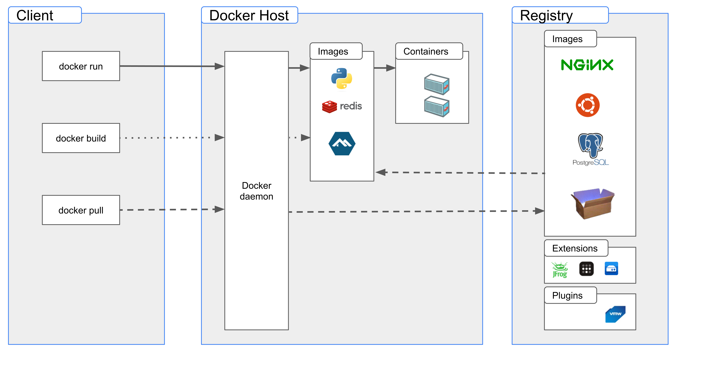

# Week 1 — App Containerization

## Containerize Application (Dockerfiles, Docker Compose)
Docker is an open platform for developing, shipping, and running applications. Docker enables you to separate your applications from your infrastructure so you can deliver software quickly. 

Docker provides the ability to package and run an application in a loosely isolated environment called a container. The isolation and security allows you to run many containers simultaneously on a given host. Containers are lightweight and contain everything needed to run the application, so you do not need to rely on what is currently installed on the host.

### Docker architecture

Docker uses a client-server architecture. The Docker client talks to the Docker daemon, which does the heavy lifting of building, running, and distributing your Docker containers.



#### **Docker Compose** 
It is a tool for defining and running multi container Docker Applications (It uses yml file).

## Security on Container
Container Security is the practice of protecting your application hosted on compute service like containers.
We have manage and unmanaged containers
Managed Containers means that the Provider (AWS) managed the underlying service for the container (ECS or EKS). In this case Cloud provider will be managing the security prospective .

Unmanaged Containers means you are running your container on your servers and you have to manage all the system (for example you will be in charged to apply security patches).

#### Security Best Practices
- Keep Host & Docker Updated to latest security patches.
- Docker Deamon & containers should run in non root user mode
- Image Vulnerability Scanning
- Trust a Private vs Public Image Registry
- No Sensitive Data in Docker Files or Images
- Use Secret Management Services to share secrets.

### Tool to detect vulnerability on your Docker Compose
Snyk OpenSource Security

### Tools to Store and Manage Secrets
- Aws Secret Manager
- Hashicorp Vault


## Pricing Consideration for CDE

### Gitpod
- Up To 50 Hours of Usage/Month
- Standard: 4 Cores, 8GB Ram and 30GB Storage
- Avoid spinning multiple enviroment at the time as it consume your 50Hours free tier quicker.

Always check your billing, to know how mnay hours you have left
 
 ### Github Codespaces
 2 flavours:
 - Up to 60 Hours of usage with 2 core 4GB RAM and 15GB of Storage
- Up to 30 Hours of usage with 4 core 8GB RAM and 15GB of Storage

### AWS Cloud9
- Covered under free tier if you use the T2.micro instance'
- Avoid using Cloud9 in case of free tier instance in use for other purpose.

### Creating docker backend
To create the docker configuration for the backend-flask, create a file called **Dockerfile** and copy the following code

```
FROM python:3.10-slim-buster

WORKDIR /backend-flask

COPY requirements.txt requirements.txt
RUN pip3 install -r requirements.txt

COPY . .

ENV FLASK_ENV=development

EXPOSE ${PORT}
CMD [ "python3", "-m" , "flask", "run", "--host=0.0.0.0", "--port=4567"]
```

from the project directory type the following code to build the image
```
docker build -t backend-flask ./backend-flask
```

typing this command to run the image of the container
```
docker run --rm -p 4567:4567 -it backend-flask
```


this code create the 2 var env and run the container

```
docker run --rm -p 4567:4567 -it -e FRONTEND_URL='*' -e BACKEND_URL='*' backend-flask
```
